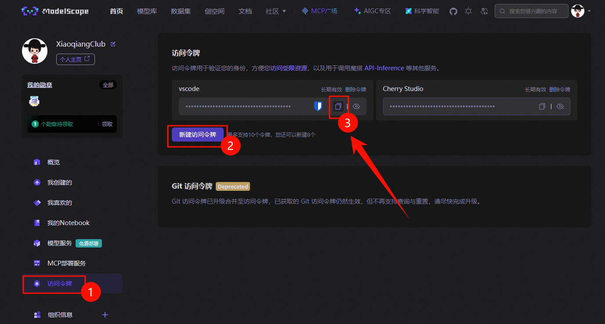

<div align="center">


[](https://pypi.org/project/msimg/) [](https://www.python.org/) [](https://github.com/xiaoqiangclub/msimg/blob/main/LICENSE) [](https://www.modelscope.cn/)


</div>

# 🎨 msimg
> 💫 ModelScope 图像生成库

一个优雅的魔塔社区文生图 API 调用库，支持多模型、多 API、容错重试、图床上传、消息通知等高级特性。

## 📑 目录

- [✨ 特性](#-特性)
- [📦 安装](#-安装)
- [🔑 获取 API Key](#-获取-api-key)
- [🚀 快速开始](#-快速开始)
  - [最简单的用法](#最简单的用法)
  - [使用预设模型](#使用预设模型)
  - [高级用法](#高级用法)
- [📖 详细文档](#-详细文档)
  - [🎯 预设模型列表](#-预设模型列表)
  - [⚙️ API 配置说明](#️-api-配置说明)
  - [🎲 选择策略说明](#-选择策略说明)
  - [📐 支持的图片尺寸](#-支持的图片尺寸)
  - [📤 图床上传](#-图床上传)
  - [📢 消息通知](#-消息通知)
  - [📋 完整参数说明](#-完整参数说明)
  - [❓ 常见问题](#-常见问题)
- [🔗 相关链接](#-相关链接)
- [💖 打赏支持](#-打赏支持)
- [📄 许可证](#-许可证)
- [👤 作者](#-作者)

---

## ✨ 特性

- 🚀 **简单易用** - 一行代码即可生成图片
- 🎯 **预设模型** - 内置多个热门模型，开箱即用
- 🔄 **智能容错** - 支持多 API、多模型自动切换
- 🌐 **网络重试** - 自动处理网络错误和超时
- 📤 **内置图床** - 预设 8 种图床服务，支持故障转移
- 📢 **消息通知** - 灵活的消息回调机制
- ⚙️ **高度可配置** - 丰富的参数满足各种需求
- 🎲 **多种策略** - 支持顺序、随机、轮询等选择策略
- 💰 **免费额度** - 每天 2000 次免费调用

## 📦 安装

```bash
# 基础安装（免费图床）
pip install msimg

# 安装七牛云支持
pip install msimg[qiniu]

# 安装阿里云支持
pip install msimg[aliyun]

# 安装又拍云支持
pip install msimg[upyun]

# 安装全部云服务
pip install msimg[all]
```

**环境要求**：
- 🐍 Python 3.8+
- 📦 核心依赖：`requests`, `Pillow`

**可选依赖**（图床服务）：
```bash
# 七牛云
pip install qiniu

# 阿里云 OSS
pip install oss2

# 又拍云
pip install upyun
```

---

## 🔑 获取 API Key

### 步骤 1：注册魔塔社区账号

1. 🌐 访问 [魔塔社区官网](https://www.modelscope.cn/)
2. 👤 点击右上角「注册」按钮
3. 📧 使用邮箱或手机号完成注册

### 步骤 2：创建 API Token

1. 🔐 登录后访问：[https://www.modelscope.cn/my/myaccesstoken](https://www.modelscope.cn/my/myaccesstoken)
2. ➕ 点击「`新建访问令牌`」按钮
3. 📝 填写 Token 名称（如：`msimg-token`）
4. ✅ 点击「确定」生成 Token
5. 📋 复制生成的 API Key



### 免费额度说明

魔塔社区提供慷慨的免费额度 (API-Inference)：

| 项目 | 额度 | 说明 |
|------|------|------|
| 💎 **总调用次数** | 2000次/天 | 所有模型合计 |
| 🎯 **单模型调用** | 500次/天 | 每个模型独立计算 |
| 🔄 **重置时间** | 每天 00:00 | 自动重置额度 |

**💡 提示**：
- ✅ 免费额度足够个人开发和测试使用
- ✅ 可以配置多个模型实现更高的总调用次数
- ✅ 超出免费额度后可以购买付费套餐

> 💡 提示：如需更多帮助，请访问 [魔塔社区文档](https://www.modelscope.cn/docs/model-service/API-Inference/intro) 或联系客服。

---

## 🚀 快速开始

### 最简单的用法

```python
from msimg import generate_image

# 使用默认模型（通义万相）生成图片
result = generate_image(
    prompt="一只金色的猫坐在云朵上",
    api_configs="your-api-key"  # 替换为你的 API Key
)

if result:
    result['image'].show()  # 显示图片
    print(f"✅ 图片尺寸: {result['size']}")
```

### 使用预设模型

```python
result = generate_image(
    prompt="赛博朋克城市夜景，霓虹灯闪烁，未来感十足",
    api_configs="your-api-key",
    models="flux-majic",  # 使用预设模型
    size="16:9",          # 16:9 比例
    save_path="city.jpg"  # 保存到本地
)

if result:
    print(f"✅ 生成成功！保存到: city.jpg")
```

### 高级用法

```python
from msimg import (
    generate_image,
    APIConfig,
    SelectionStrategy,
    NotificationMode,
    create_smms_uploader,  # 内置图床上传器
)

# 多 API、多模型容错 + 图床上传
result = generate_image(
    prompt="美丽的日落海景",
    
    # 配置多个 API（自动故障转移）
    api_configs=[
        APIConfig(api_key="key1", name="主站"),
        APIConfig(api_key="key2", name="备用站"),
    ],
    
    # 配置多个模型（优先级排序）
    models=["flux-majic", "qwen", "sdxl-muse"],
    
    # 启用容错
    enable_failover=True,
    
    # 图床上传（使用内置上传器）
    image_upload_callbacks=[
        create_smms_uploader(api_token="your-smms-token"),
    ],
    upload_on_success=True,
    
    # 自定义尺寸
    size="1920x1080",
)

if result:
    print(f"图片URL: {result['url']}")
```

---

## 📖 详细文档

### 🎯 预设模型列表

msimg 内置了以下热门模型，可以直接使用预设名称调用：

| 预设名称 | 完整 Model ID | 说明 |
|---------|--------------|------|
| 🎨 `qwen` / `qwen-image` | `Qwen/Qwen-Image` | 通义万相 - 阿里巴巴出品，综合能力强 |
| ✨ `flux-majic` | `MAILAND/majicflus_v1` | FLUX 魔法模型 - 艺术风格出色 |
| 🎭 `flux-muse` | `MusePublic/489_ckpt_FLUX_1` | FLUX Muse 版本 - 创意效果好 |
| 📱 `flux-xiaohongshu` | `yiwanji/FLUX_xiao_hong_shu_ji_zhi_zhen_shi_V2` | FLUX 小红书风格 - 适合社交媒体 |
| 🖼️ `sdxl-muse` | `MusePublic/42_ckpt_SD_XL` | Stable Diffusion XL - 经典模型 |

#### 📚 获取更多模型

除了内置的预设模型，你还可以：

**1️⃣ 访问魔塔社区模型库**

🔗 [获取更多模型](https://www.modelscope.cn/models?filter=inference_type&page=1&tabKey=task&tasks=hotTask:text-to-image-synthesis&type=tasks)

在这里可以：
- 🔍 浏览所有支持推理的文生图模型
- 📊 查看模型的使用次数和评分
- 📝 了解模型的详细介绍和示例
- 🎯 选择最适合你需求的模型

**2️⃣ 使用完整的 Model ID**

```python
result = generate_image(
    prompt="美丽的风景",
    api_configs="your-api-key",
    models="YourUserName/YourModelName"  # 使用完整 Model ID
)
```

**3️⃣ 混合使用预设和自定义模型**

```python
result = generate_image(
    prompt="测试图片",
    api_configs="your-api-key",
    models=[
        "qwen",                          # ✅ 预设模型
        "CustomUser/CustomModel",        # ✅ 自定义模型
        "flux-majic"                     # ✅ 预设模型
    ],
    enable_failover=True  # 🔄 启用容错，按顺序尝试
)
```

---

### ⚙️ API 配置说明

`APIConfig` 类用于配置 ModelScope API 的连接信息，支持灵活的配置方式。

#### 基础用法

```python
from msimg import APIConfig

# 方式 1: 仅提供 API Key（使用默认服务地址）
config = APIConfig(api_key="your-api-key")

# 方式 2: 自定义服务地址
config = APIConfig(
    api_key="your-api-key",
    base_url="https://custom-api.example.com/",
    name="自定义API"  # 可选，用于日志显示
)
```

#### APIConfig 参数说明

| 参数 | 类型 | 必需 | 默认值 | 说明 |
|------|------|------|--------|------|
| 🔑 `api_key` | `str` | ✅ 是 | - | ModelScope API 密钥 |
| 🌐 `base_url` | `str` | ❌ 否 | `https://api-inference.modelscope.cn/` | API 服务地址 |
| 🏷️ `name` | `str` | ❌ 否 | 自动生成 | API 名称，用于日志识别 |

#### 多种配置方式

msimg 支持多种灵活的 API 配置方式：

```python
from msimg import generate_image, APIConfig

# 1️⃣ 单个 API Key 字符串（最简单）
result = generate_image(
    prompt="test",
    api_configs="your-api-key"
)

# 2️⃣ 多个 API Key 字符串（自动故障转移）
result = generate_image(
    prompt="test",
    api_configs=["key1", "key2", "key3"]
)

# 3️⃣ 单个 APIConfig 对象（自定义配置）
result = generate_image(
    prompt="test",
    api_configs=APIConfig(
        api_key="your-key",
        base_url="https://custom.api.com/",
        name="主API"
    )
)

# 4️⃣ 多个 APIConfig 对象（完全控制）
result = generate_image(
    prompt="test",
    api_configs=[
        APIConfig(api_key="key1", name="主站"),
        APIConfig(api_key="key2", name="备用站"),
    ]
)

# 5️⃣ 混合配置（字符串 + APIConfig）
result = generate_image(
    prompt="test",
    api_configs=[
        "simple-key",  # 使用默认配置
        APIConfig(api_key="custom-key", base_url="https://custom.com/")
    ]
)
```

#### 🔐 获取 API Key

访问 [ModelScope 控制台](https://www.modelscope.cn/my/myaccesstoken) 创建你的 API Token（查看 [详细步骤](#-获取-api-key)）。

---

### 🎲 选择策略说明

msimg 提供了灵活的选择策略（`SelectionStrategy`），用于控制多个资源（API、模型、图床、通知）的选择行为。

#### 策略类型

```python
from msimg import SelectionStrategy

# 三种可用策略
SelectionStrategy.SEQUENTIAL    # 📋 顺序选择
SelectionStrategy.RANDOM        # 🎲 随机选择
SelectionStrategy.ROUND_ROBIN   # 🔄 轮询选择
```

#### 策略详解

| 策略 | Emoji | 说明 | 适用场景 | 行为示例 |
|------|-------|------|----------|----------|
| `SEQUENTIAL` | 📋 | 顺序选择 | 优先级排序、故障转移 | 按列表顺序依次尝试：A → B → C |
| `RANDOM` | 🎲 | 随机选择 | 负载均衡、测试 | 每次随机选择：B → A → C → A |
| `ROUND_ROBIN` | 🔄 | 轮询选择 | 负载均衡、公平分配 | 循环选择：A → B → C → A → B |

#### 💡 策略组合最佳实践

```python
# 📌 生产环境推荐配置
result = generate_image(
    prompt="生产环境图片",
    
    # 🌐 API: 主备模式
    api_configs=[main_api, backup_api],
    api_selection_strategy=SelectionStrategy.SEQUENTIAL,
    
    # 🤖 模型: 质量优先
    models=["flux-majic", "qwen"],
    model_selection_strategy=SelectionStrategy.SEQUENTIAL,
    
    # 📤 图床: 故障转移
    image_upload_callbacks=[upload_primary, upload_backup],
    upload_strategy=SelectionStrategy.SEQUENTIAL,
    
    enable_failover=True
)
```

---

### 📐 支持的图片尺寸

#### 预设比例

| 比例 | 分辨率 | 适用场景 |
|------|--------|----------|
| 🟦 `1:1` | 1328x1328 | 社交媒体头像、方形图片 |
| 📺 `16:9` | 1664x928 | 横向壁纸、演示文稿 |
| 📱 `9:16` | 928x1664 | 手机壁纸、竖屏视频封面 |
| 🖼️ `4:3` | 1472x1140 | 传统照片、iPad 壁纸 |
| 📄 `3:4` | 1140x1472 | 竖向海报 |
| 📷 `3:2` | 1584x1056 | 相机标准比例 |
| 📖 `2:3` | 1056x1584 | 书籍封面、竖向印刷品 |

#### 自定义尺寸

```python
# ✅ 使用预设比例
result = generate_image(
    prompt="test",
    api_configs="key",
    size="16:9"
)

# ✅ 使用自定义尺寸（宽x高）
result = generate_image(
    prompt="test",
    api_configs="key",
    size="1920x1080"  # 自定义任意尺寸
)
```

---

### 📤 图床上传

msimg 内置了 **8 种常用图床服务**，开箱即用，无需自己实现上传逻辑！

#### 🎯 内置图床列表

| 图床 | 特点 | 免费额度 | 需要注册 |
|------|------|----------|----------|
| 🌐 **SM.MS** | 国内优化，速度快 | 5MB/图 | ✅ |
| 📸 **路过图床** | 无需注册 | 10MB/图 | 🚫 似乎嘎了 |
| 🎨 **ImgURL** | 相册管理 | 10MB/图 | ✅ |
| ☁️ **七牛云** | 企业级稳定 | 10GB 存储 | ✅ |
| 🔷 **阿里云 OSS** | 大厂服务 | 40GB 存储 | ✅ |
| 🌊 **又拍云** | 国内快速 | 10GB 存储 | ✅ |
| 🐙 **GitHub** | 完全免费 | 不限流量 | ✅ |
| 💾 **本地存储** | 自建服务 | 无限制 | ❌ |

>💡 进入源码可查看更详细的说明，由于一些接口是我以前写的，可能存在图床已经失效的情况，请自行替换。
#### 快速开始

**方式 1：使用免费图床（推荐新手）**

```python
from msimg import generate_image, create_luoguo_uploader

# 路过图床无需注册
uploader = create_luoguo_uploader()

result = generate_image(
    prompt="一只可爱的猫咪",
    api_configs="your-api-key",
    image_upload_callbacks=[uploader],
    upload_on_success=True
)

if result and result['url']:
    print(f"图床URL: {result['url']}")
```

**方式 2：使用 SM.MS（推荐生产环境）**

```python
from msimg import generate_image, create_smms_uploader

# 创建 SM.MS 上传器
uploader = create_smms_uploader(
    api_token="your-smms-token",  # 在 https://smms.app/home/apitoken 获取
    api_domain="https://smms.app"  # 国内优化（默认）
)

result = generate_image(
    prompt="美丽的风景",
    api_configs="your-api-key",
    image_upload_callbacks=[uploader],
    upload_on_success=True
)
```

**方式 3：多图床故障转移**

```python
from msimg import (
    generate_image,
    create_smms_uploader,
    create_luoguo_uploader,
    create_github_uploader,
    SelectionStrategy,
)

result = generate_image(
    prompt="测试图片",
    api_configs="your-api-key",
    
    # 配置多个图床（按顺序尝试）
    image_upload_callbacks=[
        create_smms_uploader(api_token="token"),  # 优先
        create_luoguo_uploader(),                 # 备选 1
        create_github_uploader(                   # 备选 2
            token="github-token",
            repo="username/repo"
        ),
    ],
    upload_strategy=SelectionStrategy.SEQUENTIAL,  # 故障转移
    upload_on_success=True
)
```

#### 📚 详细配置

##### SM.MS

```python
from msimg import create_smms_uploader

uploader = create_smms_uploader(
    api_token="your-token",         # 可选，建议提供
    api_domain="https://smms.app"   # 国内优化（默认）
)
```

**获取 Token**：
- 国内：https://smms.app/home/apitoken
- 国际：https://sm.ms/home/apitoken

##### 路过图床（无需注册）

```python
from msimg import create_luoguo_uploader

uploader = create_luoguo_uploader()  # 无需任何配置
```
>🤐 似乎嘎了...
##### ImgURL

```python
from msimg import create_imgurl_uploader

uploader = create_imgurl_uploader(
    api_token="your-token",
    api_uid="your-uid"
)
```

**获取配置**：https://www.imgurl.org/vip/manage/api

##### 七牛云

```python
from msimg import create_qiniu_uploader

uploader = create_qiniu_uploader(
    access_key="your-access-key",
    secret_key="your-secret-key",
    bucket="your-bucket",
    domain="your-cdn-domain.com"
)
```

**依赖**：`pip install qiniu`

##### 阿里云 OSS

```python
from msimg import create_aliyun_uploader

uploader = create_aliyun_uploader(
    access_key_id="your-key-id",
    access_key_secret="your-key-secret",
    endpoint="oss-cn-hangzhou.aliyuncs.com",
    bucket_name="your-bucket"
)
```

**依赖**：`pip install oss2`

##### 又拍云

```python
from msimg import create_upyun_uploader

uploader = create_upyun_uploader(
    bucket="service-name",
    username="operator",
    password="password",
    domain="your-domain.com"
)
```

**依赖**：`pip install upyun`

##### GitHub

```python
from msimg import create_github_uploader

uploader = create_github_uploader(
    token="your-github-token",
    repo="username/repo",
    branch="main",
    use_jsdelivr=True  # 使用 CDN 加速
)
```

##### 本地存储

```python
from msimg import create_local_uploader

uploader = create_local_uploader(
    storage_dir="/var/www/images",
    base_url="https://your-domain.com/images"
)
```

#### 🔧 独立使用图床

图床上传器也可以独立使用，不依赖 `generate_image`：

```python
from msimg import create_smms_uploader
from PIL import Image

# 创建上传器
uploader = create_smms_uploader(api_token="your-token")

# 支持多种输入格式：

# 1️⃣ 本地文件路径
url = uploader('/path/to/image.jpg')

# 2️⃣ 网络图片 URL
url = uploader('https://example.com/image.jpg')

# 3️⃣ PIL.Image 对象
img = Image.open('photo.jpg')
url = uploader(img)

# 4️⃣ Base64 字符串
url = uploader('data:image/png;base64,iVBORw0KGgo...')

# 5️⃣ 图片字节流
with open('photo.jpg', 'rb') as f:
    url = uploader(f.read())

print(f"图片URL: {url}")
```

#### 💡 自定义图床

如果需要使用其他图床，可以自定义上传函数：

```python
from PIL import Image

def custom_uploader(image):
    """
    自定义图床上传函数
    
    参数:
        image: 支持多种格式（PIL.Image、路径、URL、Base64、字节流）
    返回:
        str: 图片 URL
    """
    from msimg.image_uploader import _image_to_bytes
    
    # 使用辅助函数转换图片
    file_data, filename = _image_to_bytes(image, format='PNG')
    
    # 上传到你的图床 API
    import requests
    response = requests.post(
        'https://your-api.com/upload',
        files={'file': (filename, file_data)},
        headers={'Authorization': 'Bearer YOUR_TOKEN'}
    )
    
    return response.json()['url']

# 使用自定义上传器
result = generate_image(
    prompt="test",
    api_configs="key",
    image_upload_callbacks=[custom_uploader],
    upload_on_success=True
)
```

---

### 📢 消息通知

> 💡 **推荐工具**：可以使用 [xqcsendmessage](https://pypi.org/project/xqcsendmessage/) 提供的通知服务（简陋的自用工具）。

#### 基础用法

```python
from msimg import generate_image, NotificationMode, SelectionStrategy

def send_to_wechat(data):
    """发送到微信"""
    message = data['message']
    is_success = data['is_success']
    extra_data = data.get('data', {})
    
    # 实现你的通知逻辑
    print(f"💬 微信通知: {message}")
    if 'url' in extra_data:
        print(f"🔗 图片链接: {extra_data['url']}")

def send_to_email(data):
    """发送到邮箱"""
    # 实现邮件通知逻辑
    pass

result = generate_image(
    prompt="test",
    api_configs="key",
    
    # 📢 消息通知配置
    notification_callbacks=[send_to_wechat, send_to_email],
    notification_mode=NotificationMode.ALL,  # 发送所有消息
    notification_strategy=SelectionStrategy.SEQUENTIAL,  # 所有渠道都通知
)
```

#### 通知函数要求

```python
def your_notification_function(data: dict) -> None:
    """
    消息通知函数模板
    
    参数:
        data: 通知数据字典，包含：
            - message: str, 消息内容
            - is_success: bool, 是否成功
            - data: dict, 附加数据（可选）
                - prompt: 提示词
                - model: 使用的模型
                - api: 使用的 API
                - url: 图床 URL（如果上传成功）
                - size: 图片尺寸
    
    返回:
        None
    """
    message = data['message']
    is_success = data['is_success']
    extra_data = data.get('data', {})
    
    # 实现你的通知逻辑
    pass
```

#### 通知模式说明

```python
from msimg import NotificationMode

# ✅ SUCCESS: 仅发送成功消息
notification_mode=NotificationMode.SUCCESS

# ❌ ERROR: 仅发送错误消息
notification_mode=NotificationMode.ERROR

# 📣 ALL: 发送所有消息（成功和错误）
notification_mode=NotificationMode.ALL

# 🔇 NONE: 不发送消息（默认）
notification_mode=NotificationMode.NONE
```

---

### 📋 完整参数说明

```python
from msimg import generate_image, SelectionStrategy, NotificationMode

result = generate_image(
    # ==================== 基础参数 ====================
    prompt="提示词",                    # ✏️ 必需：图片生成提示词
    api_configs="api-key",              # 🔑 必需：API配置（支持多种格式）
    
    # ==================== 模型配置 ====================
    models="qwen",                      # 🤖 模型名称（预设名或完整ID）
    model_selection_strategy=SelectionStrategy.SEQUENTIAL,  # 🎲 模型选择策略
    
    # ==================== 图片配置 ====================
    size="16:9",                        # 📐 图片尺寸（预设比例或自定义）
    save_path="output.jpg",             # 💾 本地保存路径（可选）
    
    # ==================== API 配置 ====================
    api_selection_strategy=SelectionStrategy.SEQUENTIAL,  # 🌐 API选择策略
    
    # ==================== 容错和重试 ====================
    enable_failover=True,               # 🔄 是否启用容错（API/模型自动切换）
    max_retries=3,                      # 🔁 网络错误最大重试次数
    retry_on_network_error=True,        # 🌐 是否在网络错误时重试
    retry_delay=2.0,                    # ⏰ 重试间隔时间（秒）
    
    # ==================== 超时配置 ====================
    submit_timeout=30,                  # ⏱️ 提交任务超时时间（秒）
    poll_timeout=300,                   # ⏳ 轮询任务状态总超时时间（秒）
    download_timeout=60,                # ⬇️ 下载图片超时时间（秒）
    poll_interval=5,                    # 🔄 轮询间隔时间（秒）
    
    # ==================== 图床上传 ====================
    image_upload_callbacks=[upload_func],  # 📤 图床上传函数列表
    upload_strategy=SelectionStrategy.SEQUENTIAL,  # 🎲 上传策略
    upload_on_success=False,            # 🚀 是否在生成成功后自动上传
    
    # ==================== 消息通知 ====================
    notification_callbacks=[notify_func],  # 📢 消息通知函数列表
    notification_mode=NotificationMode.NONE,  # 📣 通知模式
    notification_strategy=SelectionStrategy.SEQUENTIAL,  # 🎲 通知策略
    
    # ==================== 其他配置 ====================
    verbose=True,                       # 📝 是否显示详细日志
    proxies={'http': 'http://proxy:port'},  # 🌐 代理配置（可选）
)
```

#### 返回值说明

```python
# ✅ 成功时返回字典
{
    'image': PIL.Image对象,      # 🖼️ 生成的图片
    'url': str,                  # 🔗 图床URL（如果上传成功）
    'model': str,                # 🤖 实际使用的模型
    'api': str,                  # 🌐 实际使用的API名称
    'size': tuple,               # 📐 图片尺寸 (width, height)
}

# ❌ 失败时返回 None
```

---

### ❓ 常见问题

#### 1. 🔑 如何获取 API Key？

访问 [ModelScope 控制台](https://www.modelscope.cn/my/myaccesstoken) 创建 API Token。详细步骤请查看 [获取 API Key](#-获取-api-key) 章节。

#### 2. 🤖 支持哪些模型？

- ✅ 内置预设模型：`qwen`, `flux-majic`, `flux-muse`, `flux-xiaohongshu`, `sdxl-muse`
- 🔍 访问 [魔塔社区文生图模型库](https://www.modelscope.cn/models?filter=inference_type&page=1&tabKey=task&tasks=hotTask:text-to-image-synthesis&type=tasks) 查看所有可用模型
- 📝 可以使用任何支持推理的模型的完整 Model ID

#### 3. 📤 如何选择合适的图床？

| 场景 | 推荐图床 |
|------|----------|
| 🚀 快速体验 | 路过图床（无需注册） |
| 🎈 个人项目 | SM.MS（国内快） |
| 💼 商业项目 | 七牛云、阿里云 OSS |
| 🌍 国际项目 | GitHub + CDN |

#### 4. 🔄 如何配置多个 API 实现容错？

```python
result = generate_image(
    prompt="test",
    api_configs=["key1", "key2", "key3"],  # 多个API Key
    enable_failover=True,                   # 启用容错
    api_selection_strategy=SelectionStrategy.SEQUENTIAL  # 顺序尝试
)
```

#### 5. ❌ 图片生成失败怎么办？

- 🔑 检查 API Key 是否正确
- 🤖 确认模型 ID 是否支持
- 🌐 检查网络连接
- 📝 启用 `verbose=True` 查看详细日志
- 🔁 增加 `max_retries` 重试次数
- 🔄 配置多个 API 实现容错

#### 6. 📦 如何实现批量生成？

```python
from msimg import generate_image, create_luoguo_uploader

uploader = create_luoguo_uploader()
prompts = ["猫", "狗", "鸟", "鱼"]

for i, prompt in enumerate(prompts):
    result = generate_image(
        prompt=prompt,
        api_configs="your-key",
        models="qwen",
        save_path=f"image_{i}.jpg",
        image_upload_callbacks=[uploader],
        upload_on_success=True,
        verbose=False
    )
    if result:
        print(f"✅ {prompt}: {result['url']}")
```

#### 7. 🌐 支持代理吗？

```python
result = generate_image(
    prompt="test",
    api_configs="key",
    proxies={
        'http': 'http://proxy.example.com:8080',
        'https': 'https://proxy.example.com:8080'
    }
)
```

#### 8. 💰 免费额度用完了怎么办？

- 🔄 等待每天 00:00 自动重置额度
- 🤖 配置多个模型分散使用（每个模型 500次/天）
- 💎 购买魔塔社区的付费套餐
- 🔑 使用多个 API Key 轮流调用

#### 9. 🖼️ 图床上传的图片支持哪些格式？

图床上传器支持 5 种输入格式：
- 📁 本地文件路径：`'/path/to/image.jpg'`
- 🌐 网络图片 URL：`'https://example.com/image.jpg'`
- 🎨 PIL.Image 对象：`Image.open('photo.jpg')`
- 📄 Base64 字符串：`'data:image/png;base64,...'`
- 💾 图片字节流：`b'\x89PNG\r\n...'`

#### 10. 🔧 如何自定义图床？

参考 [图床上传 - 自定义图床](#-自定义图床) 章节，实现符合接口规范的上传函数即可。

---

## 🔗 相关链接

- 🏠 **ModelScope 官网**：[https://www.modelscope.cn/](https://www.modelscope.cn/)
- 🎨 **文生图模型库**：[https://www.modelscope.cn/models?tasks=text-to-image-synthesis](https://www.modelscope.cn/models?filter=inference_type&page=1&tabKey=task&tasks=hotTask:text-to-image-synthesis&type=tasks)
- 📚 **API 文档**：[https://www.modelscope.cn/docs](https://www.modelscope.cn/docs)
- 🔑 **获取 API Key**：[https://www.modelscope.cn/my/myaccesstoken](https://www.modelscope.cn/my/myaccesstoken)
- 📦 **PyPI 项目主页**：[https://pypi.org/project/msimg/](https://pypi.org/project/msimg/)
- 💻 **GitHub 仓库**：[https://github.com/xiaoqiangclub/msimg](https://github.com/xiaoqiangclub/msimg)

---

## 💖 打赏支持

如果这个项目对你有帮助，欢迎打赏支持！你的支持是我持续更新的动力 💪

<div align="center">


**扫码打赏 | 支持作者 | 持续更新**

</div>

---

## 📄 许可证

本项目采用 [MIT License](LICENSE) 开源协议。

---


<div align="center">

**Made with ❤️ by [Xiaoqiang](https://xiaoqiangclub.github.io/)**

**如果这个项目对你有帮助，请给一个 Star ⭐️**


[⬆ 回到顶部](#-msimg)

</div>